# 🛒 Mercado Livre Clone - Glaucia Lemos

<div align="center">

[](https://typescriptlang.org/)
[](https://nextjs.org/)
[](https://expressjs.com/)
[](https://tailwindcss.com/)

*Um marketplace moderno inspirado no Mercado Livre, construído com as melhores práticas de desenvolvimento full-stack*

</div>

## 📋 Índice

- [🎯 Visão Geral](#-visão-geral)
- [🏗️ Arquitetura](#️-arquitetura)
- [⚡ Funcionalidades](#-funcionalidades)
- [🛠️ Stack Tecnológica](#️-stack-tecnológica)
- [🚀 Como Executar](#-como-executar)
- [📁 Estrutura do Projeto](#-estrutura-do-projeto)
- [🎓 Conceitos Demonstrados](#-conceitos-demonstrados)
- [🔄 API Endpoints](#-api-endpoints)
- [🎨 Design System](#-design-system)
- [🧪 Testes e Qualidade](#-testes-e-qualidade)
- [🔮 Próximos Passos](#-próximos-passos)

## 🎯 Visão Geral

Este projeto é uma implementação moderna de um marketplace e-commerce inspirado no MercadoLibre, desenvolvido como demonstração de arquitetura full-stack escalável. A aplicação combina um backend robusto em Express.js com um frontend responsivo em Next.js, implementando funcionalidades essenciais de e-commerce como busca, filtros, paginação e sistema de desconto.

### ✨ Destaques

- **Arquitetura limpa** com separação clara de responsabilidades
- **Type safety** completo entre frontend e backend
- **Performance otimizada** com debounce, lazy loading e caching
- **UX moderno** com loading states, animações e feedback visual
- **Responsivo** para desktop, tablet e mobile
- **Acessibilidade** seguindo padrões WCAG
- **Extensível** preparado para features futuras

## 🏗️ Arquitetura

### Diagrama da Arquitetura


### Fluxo de Dados

```mermaid
sequenceDiagram
    participant U as 👤 User
    participant F as 🎨 Frontend
    participant API as ⚙️ Backend API
    participant D as 📁 Data Store
    
    Note over U,D: Fluxo de Busca de Produtos
    
    U->>F: Digite termo de busca
    F->>F: Aplica debounce (800ms)
    F->>API: GET /api/products?search=termo
    API->>API: Valida query com Zod
    API->>D: Filtra produtos em JSON
    D-->>API: Retorna produtos filtrados
    API-->>F: JSON com paginação
    F->>F: Atualiza estado + UI
    F-->>U: Mostra resultados
    
    Note over U,D: Aplicação de Desconto (Live Coding)
    
    U->>F: Clica "Aplicar Desconto"
    F->>F: Abre modal de desconto
    U->>F: Define percentual (15%)
    F->>API: POST /api/products/:id/discount
    API->>API: Calcula novo preço
    API->>D: Aplica desconto temporário
    D-->>API: Produto com desconto
    API-->>F: Produto atualizado
    F->>F: Atualiza preço na tela
    F-->>U: Feedback visual
```



### Arquitetura de Componentes

```mermaid
graph LR
    subgraph "🏠 Pages"
        Home[HomePage]
        Detail[ProductDetail]
    end
    
    subgraph "🧩 Components"
        ProductCard[ProductCard]
        Filters[Filters]
        Layout[Layout]
        Modal[DiscountModal]
    end
    
    subgraph "🔧 Hooks"
        useDebounce[useDebounce]
        useSearch[useSearchDebounce]
    end
    
    subgraph "🌐 Services"
        API[API Service]
        Utils[Utils]
    end
    
    Home --> ProductCard
    Home --> Filters
    Home --> useSearch
    Detail --> Modal
    Filters --> useDebounce
    ProductCard --> API
    Modal --> API
    
    API --> Utils
    
    classDef pages fill:#e3f2fd,stroke:#1976d2
    classDef components fill:#f3e5f5,stroke:#7b1fa2
    classDef hooks fill:#fff3e0,stroke:#f57c00
    classDef services fill:#e8f5e8,stroke:#388e3c
    
    class Home,Detail pages
    class ProductCard,Filters,Layout,Modal components
    class useDebounce,useSearch hooks
    class API,Utils services
```



## ⚡ Funcionalidades

### 🛍️ Core Features

- **📱 Catálogo de Produtos** - Exibição responsiva com grid adaptativo
- **🔍 Busca Inteligente** - Busca por título e descrição com debounce
- **🎯 Filtros Avançados** - Por categoria, preço, frete grátis
- **📄 Paginação** - Load more progressivo para melhor UX
- **💰 Sistema de Desconto** - Aplicação dinâmica de descontos
- **📋 Detalhes do Produto** - Página completa com todas as informações

### 🎨 UX/UI Features

- **⚡ Performance** - Loading states e skeleton screens
- **📱 Responsivo** - Design mobile-first com breakpoints customizados
- **🎭 Animações** - Transições suaves e micro-interações
- **♿ Acessibilidade** - ARIA labels, keyboard navigation, alto contraste
- **🔄 Real-time** - Updates instantâneos sem refresh

### 🛠️ Developer Features

- **🔒 Type Safety** - TypeScript end-to-end
- **✅ Validação** - Schemas Zod no backend
- **📝 Logging** - Sistema de logs detalhado
- **🐛 Error Handling** - Tratamento graceful de erros
- **🧪 Testável** - Arquitetura preparada para testes

## 🛠️ Stack Tecnológica

### Frontend

| Tecnologia | Versão | Propósito |
|------------|--------|-----------|
| **Next.js** | 14.0.0 | Framework React com SSR/SSG |
| **React** | 18.2.0 | Biblioteca de interface |
| **TypeScript** | 5.0.0 | Type safety e DX |
| **TailwindCSS** | 3.3.0 | Styling utility-first |
| **Lucide React** | Latest | Ícones SVG otimizados |

### Backend

| Tecnologia | Versão | Propósito |
|------------|--------|-----------|
| **Express.js** | 5.1.0 | Framework web minimalista |
| **TypeScript** | 5.8.3 | Type safety no servidor |
| **Zod** | 3.25.53 | Validação e parsing de schemas |
| **CORS** | 2.8.5 | Cross-origin resource sharing |
| **tsx** | 4.19.4 | Execução TypeScript |

### Desenvolvimento

| Ferramenta | Propósito |
|------------|-----------|
| **ESLint** | Linting e qualidade de código |
| **Prettier** | Formatação automática |
| **Vitest** | Framework de testes |
| **Git** | Controle de versão |

## 🚀 Como Executar

### Pré-requisitos

- **Node.js** 18+ instalado
- **npm** ou **yarn** como package manager
- **Git** para clonagem

### 🔧 Instalação

```bash
# 1. Clone o repositório
git clone https://github.com/seu-usuario/mercado-libre-clone.git
cd mercado-libre-clone

# 2. Instale dependências do backend
cd backend
npm install

# 3. Instale dependências do frontend
cd ../frontend
npm install
```

### ▶️ Execução

```bash
# Terminal 1: Backend (porta 3001)
cd backend
npm run dev

# Terminal 2: Frontend (porta 3000)
cd frontend
npm run dev
```

### 🌐 Acesso

- **Frontend:** http://localhost:3000
- **Backend API:** http://localhost:3001/api
- **Health Check:** http://localhost:3001/api/health

### 🧪 Testes

```bash
# Backend
cd backend
npm test

# Frontend
cd frontend
npm test
```

## 📁 Estrutura do Projeto

```
mercado-libre-clone/
├── 📁 backend/                  # Servidor Express.js
│   ├── 📁 src/
│   │   ├── 📁 controllers/      # Controladores HTTP
│   │   │   └── 📄 products.controller.ts
│   │   ├── 📁 services/         # Lógica de negócio
│   │   │   └── 📄 product.service.ts
│   │   ├── 📁 data/            # Dados mockados
│   │   │   └── 📄 products.json
│   │   ├── 📁 types/           # Definições TypeScript
│   │   │   └── 📄 index.ts
│   │   ├── 📁 middleware/      # Middlewares Express
│   │   │   └── 📄 error.ts
│   │   ├── 📁 routes/          # Definições de rotas
│   │   │   └── 📄 products.routes.ts
│   │   └── 📄 app.ts           # Configuração do servidor
│   ├── 📄 package.json
│   └── 📄 tsconfig.json
│
├── 📁 frontend/                 # Aplicação Next.js
│   ├── 📁 src/
│   │   ├── 📁 app/             # App Router (Next.js 14)
│   │   │   ├── 📁 products/
│   │   │   │   └── 📁 [id]/
│   │   │   │       └── 📄 page.tsx
│   │   │   ├── 📄 page.tsx     # Página principal
│   │   │   ├── 📄 layout.tsx   # Layout global
│   │   │   └── 📄 globals.css  # Estilos globais
│   │   ├── 📁 components/      # Componentes React
│   │   │   ├── 📄 ProductCard.tsx
│   │   │   ├── 📄 Filters.tsx
│   │   │   └── 📄 DiscountModal.tsx
│   │   ├── 📁 hooks/           # Custom hooks
│   │   │   └── 📄 useDebounce.ts
│   │   ├── 📁 services/        # Comunicação com API
│   │   │   └── 📄 api.service.ts
│   │   └── 📁 types/           # Tipos compartilhados
│   │       └── 📄 index.ts
│   ├── 📄 package.json
│   ├── 📄 tailwind.config.js
│   ├── 📄 next.config.js
│   └── 📄 tsconfig.json
│
├── 📄 README.md               # Este arquivo
├── 📄 run.md                  # Instruções de execução
└── 📄 doc.md                  # Documentação técnica
```

## 🎓 Conceitos Demonstrados

### 🏗️ Arquitetura e Padrões

- **🔧 Clean Architecture** - Separação em camadas bem definidas
- **🎯 Single Responsibility** - Cada classe/função tem uma responsabilidade
- **🔄 Dependency Injection** - Services injetados nos controllers
- **🏭 Factory Pattern** - Criação de instâncias padronizada
- **📦 Repository Pattern** - Abstração da camada de dados

### 🎨 Frontend Avançado

- **⚡ Custom Hooks** - Lógica reutilizável (useDebounce)
- **🔄 State Management** - Estados locais e derivados
- **🎭 Compound Components** - Componentes composáveis
- **📱 Responsive Design** - Mobile-first com breakpoints
- **♿ Accessibility** - ARIA, semântica, navegação por teclado

### ⚙️ Backend Moderno

- **✅ Input Validation** - Schemas Zod type-safe
- **🛡️ Error Handling** - Middleware centralizado
- **📝 Logging** - Sistema de logs estruturado
- **🔒 Type Safety** - TypeScript end-to-end
- **🌐 CORS** - Configuração adequada para SPA

### 🚀 Performance

- **⏱️ Debouncing** - Redução de requests desnecessários
- **🖼️ Image Optimization** - Next.js Image component
- **📦 Code Splitting** - Loading automático por rota
- **🔄 Memoization** - useCallback e useMemo estratégicos

### 🧪 Qualidade de Código

- **📏 ESLint** - Linting rules customizadas
- **🎨 Prettier** - Formatação consistente
- **📝 TypeScript** - Type checking rigoroso
- **🧪 Testing** - Estrutura preparada para testes

## 🔄 API Endpoints

### 📦 Produtos

```http
# Listar produtos com filtros
GET /api/products?search=termo&category=smartphones&page=1&limit=12

# Buscar produto específico
GET /api/products/:id

# Listar categorias disponíveis
GET /api/products/categories

# Aplicar desconto (Live Coding Feature)
POST /api/products/:id/discount
Content-Type: application/json
{
  "percentage": 15
}
```

### 🏥 Sistema

```http
# Health check
GET /api/health

# Informações da API
GET /api
```

### 📊 Exemplos de Resposta

```json
// GET /api/products
{
  "success": true,
  "data": {
    "items": [
      {
        "id": "ML-001",
        "title": "Samsung Galaxy S24 Ultra 256GB",
        "price": 6999.99,
        "currency": "BRL",
        "category": "smartphones",
        "seller": {
          "name": "Tech Premium",
          "reputation": 98
        },
        "shipping": { "free": true },
        "rating": 4.8,
        "reviews": 2847
      }
    ],
    "total": 6,
    "page": 1,
    "totalPages": 1
  }
}
```

## 🎨 Design System

### 🎨 Paleta de Cores

```css
/* Cores Principais */
--primary-blue: #3483FA;      /* Azul MercadoLibre */
--primary-yellow: #FFE600;    /* Amarelo MercadoLibre */
--success-green: #00A650;     /* Verde sucesso */
--warning-orange: #FF6900;    /* Laranja aviso */
--error-red: #F23C4D;         /* Vermelho erro */

/* Tons de Cinza */
--gray-50: #F9FAFB;
--gray-100: #F3F4F6;
--gray-500: #6B7280;
--gray-900: #111827;
```

### 📐 Tipografia

```css
/* Famílias */
font-family: -apple-system, BlinkMacSystemFont, 'Segoe UI', Roboto;

/* Escalas */
--text-xs: 0.75rem;    /* 12px */
--text-sm: 0.875rem;   /* 14px */
--text-base: 1rem;     /* 16px */
--text-lg: 1.125rem;   /* 18px */
--text-xl: 1.25rem;    /* 20px */
```

### 📱 Breakpoints

```css
/* Mobile First */
--mobile: 0px;      /* 0-639px */
--tablet: 640px;    /* 640-1023px */
--desktop: 1024px;  /* 1024-1279px */
--xl: 1280px;       /* 1280px+ */
```

### 🎭 Componentes

- **ProductCard** - Card responsivo com hover effects
- **Filters** - Sidebar de filtros com debounce
- **LoadingSpinner** - Indicadores de carregamento
- **ErrorBoundary** - Tratamento visual de erros

## 🧪 Testes e Qualidade

### 🎯 Cobertura de Testes

- **📊 Meta:** 80%+ cobertura de código
- **🧪 Unitários:** Services e utils
- **🔗 Integração:** API endpoints
- **🎭 Componentes:** Rendering e interações

### 📏 Métricas de Qualidade

```bash
# Análise estática
npm run lint          # ESLint
npm run type-check     # TypeScript
npm run format         # Prettier

# Performance
npm run build         # Bundle analysis
npm run lighthouse    # Performance audit
```

### 🛡️ Validação

- **Backend:** Validação Zod em todas as rotas
- **Frontend:** Validação de forms e inputs
- **Types:** Type safety end-to-end
- **Runtime:** Error boundaries e fallbacks

## 🔮 Próximos Passos

### 🚀 Próximas Features

- [ ] **🔐 Autenticação** - JWT + refresh tokens
- [ ] **🛒 Carrinho** - Persistência e checkout
- [ ] **💳 Pagamentos** - Integração Stripe/PayPal
- [ ] **⭐ Reviews** - Sistema de avaliações
- [ ] **🔔 Notificações** - Real-time com WebSockets
- [ ] **📊 Dashboard** - Analytics para vendedores

### 🏗️ Melhorias Técnicas

- [ ] **🗄️ Database** - PostgreSQL + Prisma ORM
- [ ] **🔄 Cache** - Redis para performance
- [ ] **🐳 Docker** - Containerização completa
- [ ] **☁️ Deploy** - CI/CD com GitHub Actions
- [ ] **📈 Monitoring** - Logs e métricas
- [ ] **🧪 Testing** - Cobertura 100% + E2E

### 📈 Escalabilidade

- [ ] **🌐 CDN** - Assets globais
- [ ] **🔍 Search** - Elasticsearch
- [ ] **📱 Mobile App** - React Native
- [ ] **🤖 AI** - Recomendações personalizadas
- [ ] **🌍 I18n** - Internacionalização
- [ ] **📊 Analytics** - Business Intelligence

---

<div align="center">

### 🤝 Contribuindo

Contributions são bem-vindas! Veja o [CONTRIBUTING.md](CONTRIBUTING.md) para guidelines.

### 📄 Licença

Este projeto está licenciado sob a [MIT License](LICENSE).

### 👨‍💻 Autor

Desenvolvido com ❤️ para demonstrar best practices em desenvolvimento full-stack.

**[⬆ Voltar ao topo](#-mercadolibre-clone)**

</div>